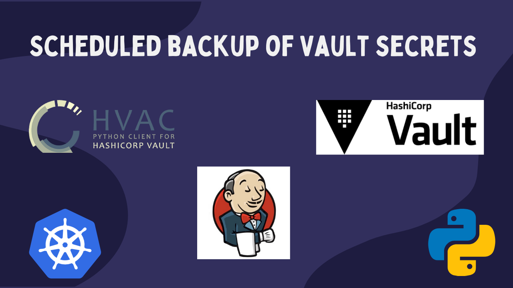
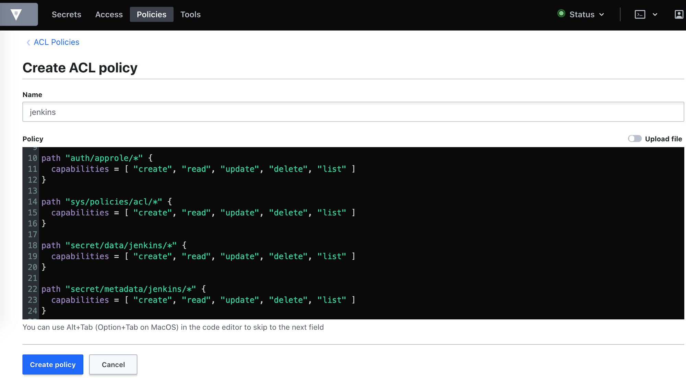

# Vault Backup

* Save HashiCorp's Vault secrets as json/yaml dump 
* Populate specific Vault prefix from json/yaml dump 



You can read how to create scheduled backup with Jenkis in this post:
[Scheduled backup of Vault secrets with Jenkins on Kubernetes](https://igorzhivilo.com/vault/scheduled-backup-vault-secrets/)

## You can use it to:

* Dump all your secrets as encrypted yaml/json files, or you can store it without encryption.
* Get a list of your secrets.
* Print all secrets nicely.
* Populate Vault from yaml/json dumps to a specific 'vault_prefix'.

## Authentication

### AppRole authentication method in Vault
How can an application programmatically request a token so that it can read secrets from Vault?

Using the AppRole which is an authentication mechanism within Vault to allow machines or apps to acquire a token to interact with Vault and using the policies you can set access limitations for your app.

It uses RoleID and SecretID for login.

Read more about AppRole authentication: 
https://learn.hashicorp.com/vault/identity-access-management/approle
https://igorzhivilo.com/jenkins/how-to-read-vault-secrets-from-declarative-pipeline/

### How to enable AppRole auth and get RoleID and SecretID

#### Enable approle on vault (using CLI)

``` bash
$ vault auth enable approle
```

#### Make sure a v2 kv secrets engine enabled (using CLI)

``` bash
$ vault secrets enable kv-v2
```

#### Create policy via Vault's UI:

I run vault inside of Kubernetes(EKS) cluster, UI not publically available that why I use port-forwarding

``` bash
$ kubectl port-forward -n vault svc/vault 8200
Forwarding from 127.0.0.1:8200 -> 8200
Forwarding from [::1]:8200 -> 8200
```

Go to policy tab -> Create ACL Policy (jenkins policy in this example)



``` bash
path "sys/auth/approle" {
  capabilities = [ "create", "read", "update", "delete", "sudo" ]
}
path "sys/auth/approle/*" {
  capabilities = [ "create", "read", "update", "delete" ]
}
path "auth/approle/*" {
  capabilities = [ "create", "read", "update", "delete", "list" ]
}
path "sys/policies/acl/*" {
  capabilities = [ "create", "read", "update", "delete", "list" ]
}
path "secret/data/jenkins/*" {
  capabilities = [ "create", "read", "update", "delete", "list" ]
}
path "secret/metadata/jenkins/*" {
  capabilities = [ "create", "read", "update", "delete", "list" ]
}
```

click 'create' this policy

attach to jenkins approle -> jenkins policy (using CLI)

``` bash
$ vault write auth/approle/role/jenkins token_policies=jenkins \
 token_ttl=1h token_max_ttl=4h
```

#### Get RoleID and SecretID (using CLI)

``` bash
$ vault read auth/approle/role/jenkins/role-id
$ vault write -f auth/approle/role/jenkins/secret-id
```

#### Test that you created correctly role_id/secret_id (using CLI)

``` bash
vault write auth/approle/login \
    role_id=ROLE_ID \
    secret_id=SECRET_ID
```

## Envinronment variables

* VAULT_ADDR: for example: 'http://vault.vault.svc.cluster.local:8200' for k8s cluster
* ROLE_ID:  RoleID for AppRole auth
* SECRET_ID:  SecretID for AppRole auth   
* VAULT_PREFIX: for example 'jenkins'
* ENCRYPTION_KEY: encryption key(used by Fernet library) to encrypt your secrets dump

## Dump secrets under 'jenkins' vault prefix example

### export ENV variables

``` bash
export VAULT_ADDR=http://vault.vault.svc.cluster.local:8200
export ROLE_ID=7ae17fff9-11aa-16d2-b5cc-dbb964a50917
export SECRET_ID=6ae17eee9-11aa-16d2-b5cc-aaa964a99917
export VAULT_PREFIX=jenkins
export ENCRYPTION_KEY="21UEdPvS7JJJBsfWbSoNM3h5AP1IowZ7iUP_YQWVoqo=",
```

###  install python dependencies

``` bash
pip install -r requirements.txt
```

## Vault's Handler CLI

``` bash
$ python vault_handler.py
Specify one of the commands below

print
print-dump
dump
populate
```

### print secrets (env variables must be exported first)

``` bash
$ python vault_handler.py print
```

### dump secrets (env variables must be exported first)

``` bash
$ python vault_handler.py dump --help
Usage: vault_handler.py dump [OPTIONS]

  :   Dump secrets from Vault (Dump will be encrypted).

Options:
  -dp, --dump_path TEXT  Path/name of dump with secrets
  --help                 Show this message and exit.
```

``` bash
# encrypted dump of secrets will be created: vault_secrets.enc
$ python vault_handler.py dump
```

### populate Vault under 'jenkins' prefix from dump (env variables must be exported first)

``` bash
python vault_handler.py populate --help
Usage: vault_handler.py populate [OPTIONS]

  :   Populate Vault prefix from dump with secrets.

Options:
  -vp, --vault_prefix TEXT  Vault's prefix to populate from secrets dump
                            [required]
  -dp, --dump_path TEXT     Path to dump with secrets
  --help                    Show this message and exit.
```

``` bash
python vault_handler.py populate -vp 'test_prefix' -dp 'vault_secrets.enc' 
```

## More things that will be added

* support for different authentication mechanisms
* add to PyPI as package
* example of how to run scheduled backup from Jenkins (Look at examples/Jenkinsfile)
* example of how to run scheduled backup using vault_handler and k8s cronjob

PRs with improvements/features are welcomed!

