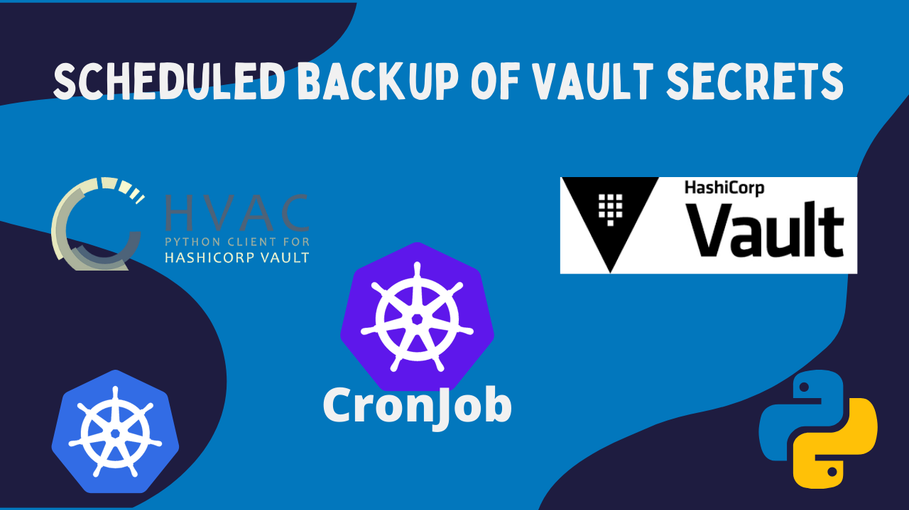

You can read how to create scheduled backup for Vault with *CronJob* in this post:
[Scheduled backup of Vault secrets with CronJob of Kubernetes](https://igorzhivilo.com/vault/scheduled-backup-vault-cronjob/)

